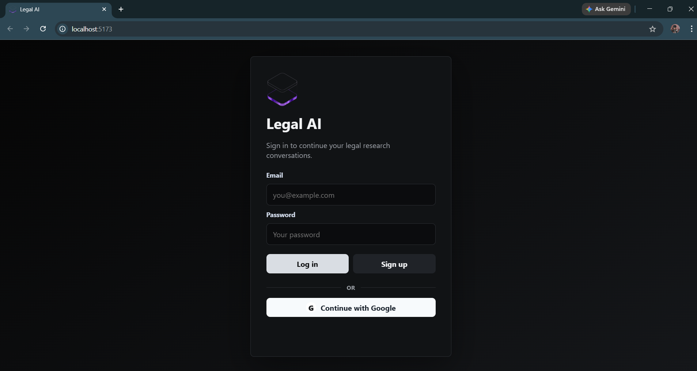
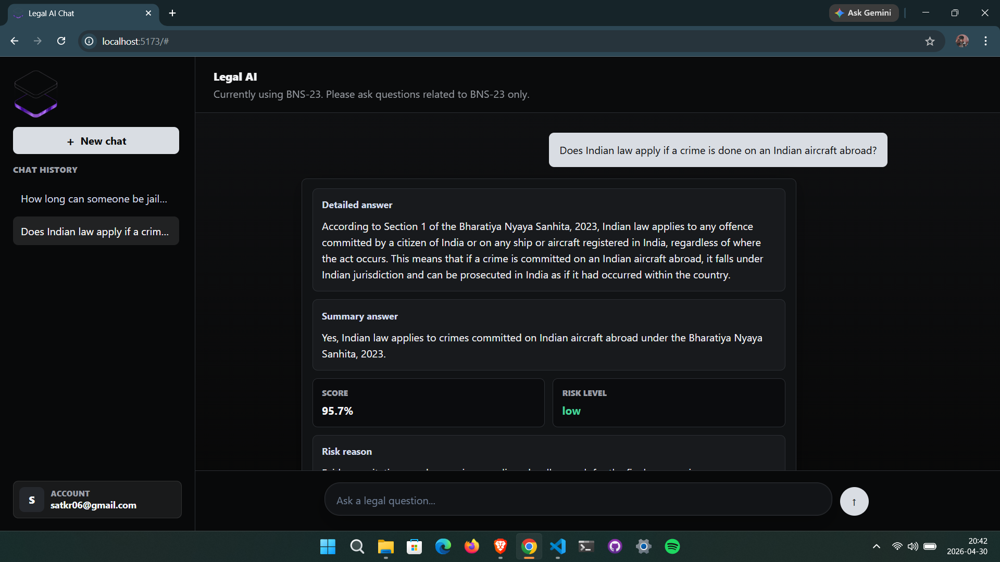
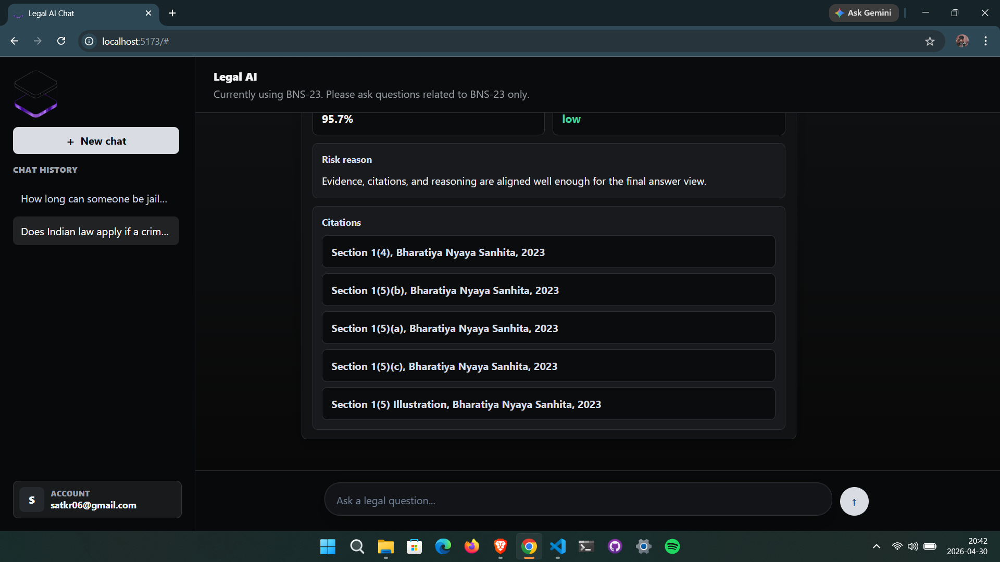
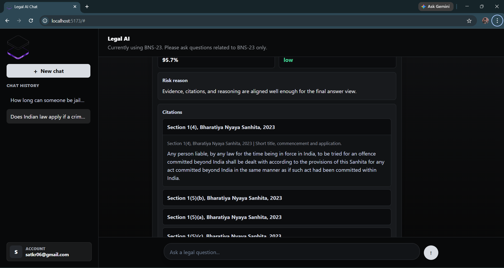

# Legal AI Assistant (BNS-23)

## Overview

Legal AI Assistant is a question-answering system focused on the Bharatiya Nyaya Sanhita, 2023 (BNS-23).  
It allows users to ask legal questions and receive structured responses supported by citations, reasoning, and evaluation metrics.

The system is designed to present answers in a transparent format, including evidence alignment and confidence indicators.

---

## Badges


---

## Features

- Chat-based legal query interface  
- Structured responses with:
  - Detailed answer  
  - Summary answer  
  - Confidence score  
  - Risk level  
  - Risk reasoning  
  - Legal citations  
- Context-based retrieval using legal chunks  
- Validation layer for aligning reasoning with evidence  
- Chat history and session interface  

---

## User Interface

### Login/Signup Interface




### Main Chat Interface



### Response Structure



### Citations Panel



---

## Example Query

Input:

Does Indian law apply if a crime is done on an Indian aircraft abroad?

Output includes:
- Legal explanation based on BNS provisions  
- Summary conclusion  
- Citations (e.g., Section 1(4), Section 1(5))  
- Confidence score (e.g., 95.7%)  
- Risk level (e.g., low)  
- Reasoning validation  

---

## System Pipeline

1. User Input  
2. Query Processing  
3. Context Retrieval  
4. Reasoning Layer  
5. Validation Layer  
6. Scoring  
7. Final Output  

---

## Tech Stack

Frontend:
- React js  
- HTML, CSS, JavaScript  

Backend:
- LLM-based reasoning pipeline  
- Retrieval-based context system  

Authentication:
- Supabase  

---

## Project Structure
```
Legal_Assistant_v1/
│
├── frontend/
│   ├── assets/        
│   ├── node_modules/             
│   ├── app.js            
│   ├── index.html           
│   ├── style.css           
│   ├── package.json           
│
├── backend/               
    ├── data/        
    ├── embedding/             
    ├── ingestion/            
    ├── query_analysis/             
    ├── validation/            
    ├── reasoning/             
    ├── retrieval/            
    ├── supabase/             
    ├── .env            
    ├── .gitignore                  
    ├── app.py            
    └── main.py              
```    
---

## Setup Instructions

Clone repository:
```
git clone https://github.com/satkr22/Legal-AI-Assistant---RAG-based-Conversational-System.git  
cd Legal-AI-Assistant---RAG-based-Conversational-System  
```

Frontend setup:
```
cd frontend  
python -m http.server 5173
```
App runs at:
http://localhost:5173  


Backend setup:
```
cd backend
uvicorn app:app --reload
```
---

## Output Format

{
  "detailed_answer": "...",
  "summary_answer": "...",
  "score": 95.7,
  "risk_level": "low",
  "risk_reason": "...",
  "citations": [
    "Section 1(4), Bharatiya Nyaya Sanhita, 2023"
  ]
}

---

## Limitations

- Restricted to Bharatiya Nyaya Sanhita, 2023  
- Accuracy depends on retrieved context  
- Confidence score is not a guarantee of correctness  

---

## Author

Satyam Kumar
